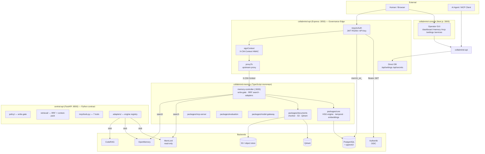
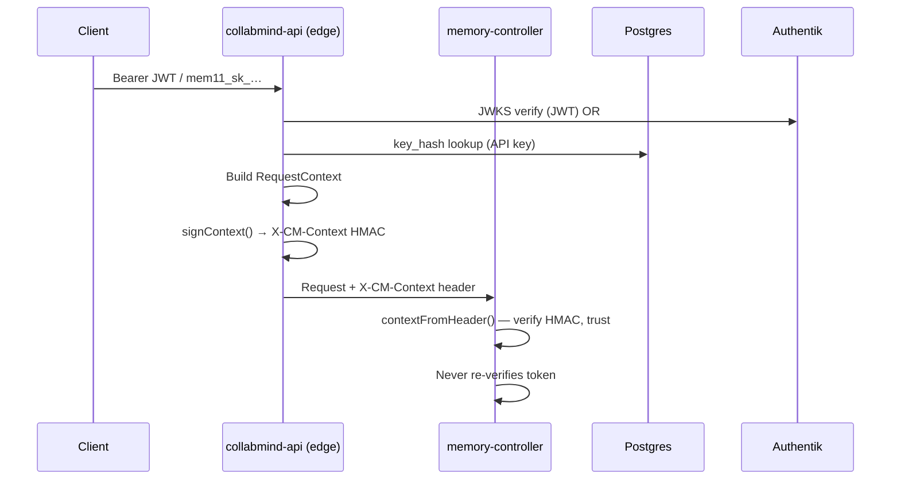
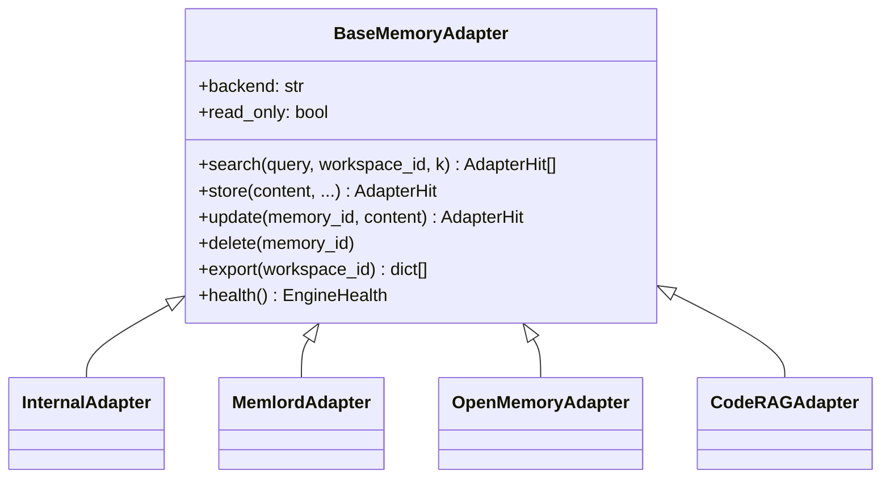

# Architecture — CollabMind Control Plane

## System Overview



## Two Parallel Implementations

The system has two implementations that share the same contract:

| Layer | TS (running) | Python (scaffold/contract) |
|-------|-------------|---------------------------|
| Edge / auth | `collabmind-api/src/auth.ts` | `central-api/app/auth/` |
| Write-gate | `memory-controller/src/governance/write-gate.ts` | `central-api/app/policy/rules.py` |
| RRF fusion | `memory-controller/src/search/unify.ts` | `central-api/app/retrieval/rrf.py` |
| Context-pack | _(not yet in TS)_ | `central-api/app/retrieval/context_pack.py` |
| MCP tools | `collabmind-memory/packages/mcp-server` | `central-api/app/mcp/tools.py` |
| Adapters | `memory-controller/src/adapters/` | `central-api/app/adapters/` |

The Python `central-api` is the **target contract** and final form. The TS stack is the **working production system**. Both are intentionally kept in sync.

## Core Architectural Patterns

### 1. Verify-Once-at-Edge



`INTERNAL_CONTEXT_SECRET` must be set identically on both services. If missing, `signContext()` throws on the edge side.

### 2. Write-Gate Pipeline

Applied **before** any memory reaches a backend. Identical logic in both TS and Python:

```mermaid
flowchart LR
    IN[Inbound content] --> R[redactSecrets\n8 regex patterns]
    R --> C[classifySensitivity\npublic|internal|restricted|secret]
    C --> D{policyDecision}
    D -->|secret| REJ[reject — never stored]
    D -->|restricted| Q[quarantine — stored, excluded from retrieval]
    D -->|public/internal| A[allow — proceed to engine]
```

Redaction patterns: `aws_access_key`, `private_key_block`, `openai_key`, `slack_token`, `github_pat`, `jwt`, `bearer`, `password_kv`.

### 3. RRF Search Fusion

Both repos use Reciprocal Rank Fusion (`RRF_K = 60`) to merge results from multiple backends (MemLord, OpenMemory, internal, documents) without requiring comparable raw scores:

```
fused_score(item) = Σ 1 / (60 + rank_in_list + 1)  for each list the item appears in
```

Cross-engine dedup is by content hash (simhash if present, else SHA-1 of normalized content).

### 4. Fail-Closed Retrieval Governance

`evaluate_retrieval()` (Python) / retrieval middleware (TS) denies on any uncertainty:

- not a workspace member → deny
- connector missing or not `connected` → deny
- document trashed or `enabled=false` → deny
- no permission snapshot → deny
- no matching Drive role (owner/organizer/writer/commenter/reader) → deny
- expired permission → deny

### 5. Adapter / Interface Pattern

All memory backends implement a common interface. The control plane never couples directly to an engine:



`MemlordAdapter.read_only = True` — MemLord owns its own writes; the federation only searches it.

### 6. Confidentiality Ceiling

Ordered levels (both repos): `public < internal < private/restricted < sensitive/secret_blocked`

A retrieval result is suppressed if its `confidentiality` metadata exceeds the actor's `confidentiality_level` in the `RequestContext`.

## Database Schema Summary

### collabmind-memory / core (PostgreSQL — migrations 00–15)

Core tables relevant to governance:

| Migration | Tables |
|-----------|--------|
| 00 | Extensions (pgvector, uuid-ossp) |
| 01 | identity: tenants, actors, source_apps, projects, api_keys |
| 02 | memories, memory_vectors (768-dim), memory_waypoints |
| 03 | temporal: temporal_facts, temporal_edges |
| 04 | governance: audit_events, archive_policies, categories |
| 06 | memory_controller: write_log, quarantine_queue |
| 07 | connectors: source_connectors, connector_accounts |
| 10 | documents: source_documents, document_chunks |
| 11 | document_indexing: indexing_jobs |
| 12 | retrieval_traces |
| 13 | model_gateway: model_routes, model_providers |
| 14 | evaluation_corrections |
| 15 | api_keys (extended) |

### central-api (SQLAlchemy Core — 11 tables)

`users`, `workspaces`, `workspace_members`, `source_connectors`, `source_documents`, `source_document_permissions`, `source_ingestion_jobs`, `source_audit_events`, `source_sync_state`, `agent_activity`, `operator_approvals`

All PKs are app-issued UUID strings. Timestamps are `DateTime(timezone=True)`. JSON blobs use `sa.JSON`. No ORM relationships — repositories layer only.

## Agent Action Control (agent_control.py)

Agents request actions; the control plane decides:

| Decision | Actions |
|----------|---------|
| `allowed` | list_workspaces, list_connected_sources, list_source_documents, list_ingestion_jobs, get_source_audit, search_governed_documents, sync_source |
| `requires_approval` | bulk_sync, source_deletion, permission_override, connector_disconnect, retrieval_across_restricted_sources |
| `denied` | anything not in either set |

Every `requires_approval` decision creates an `operator_approvals` row and is visible in the console.
