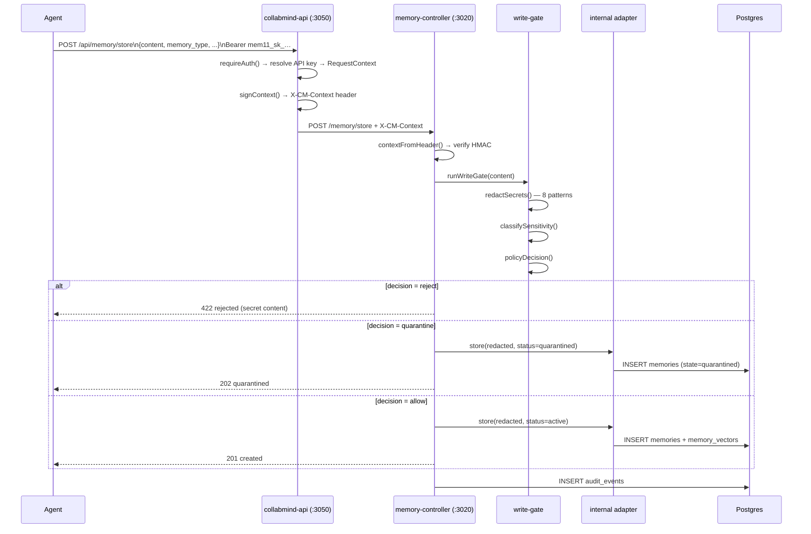
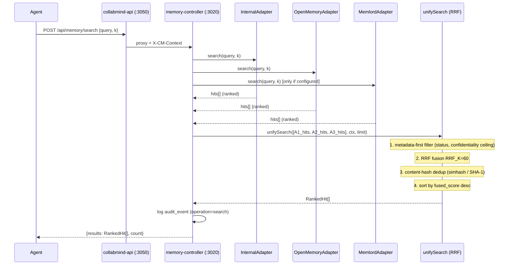
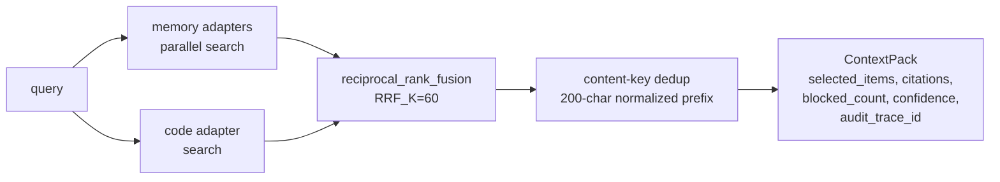
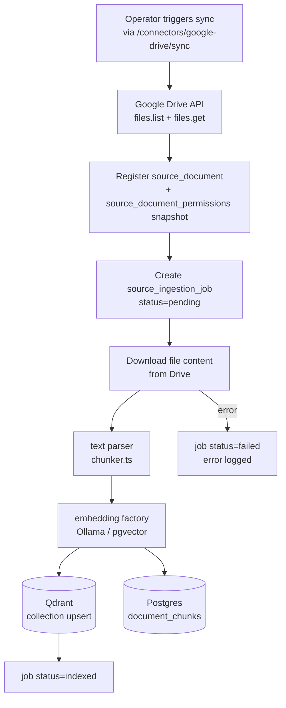
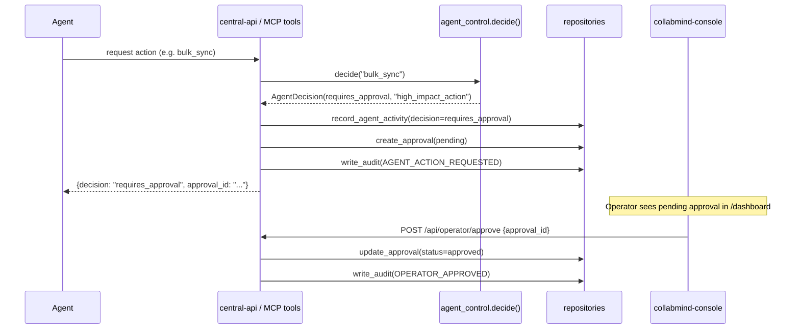
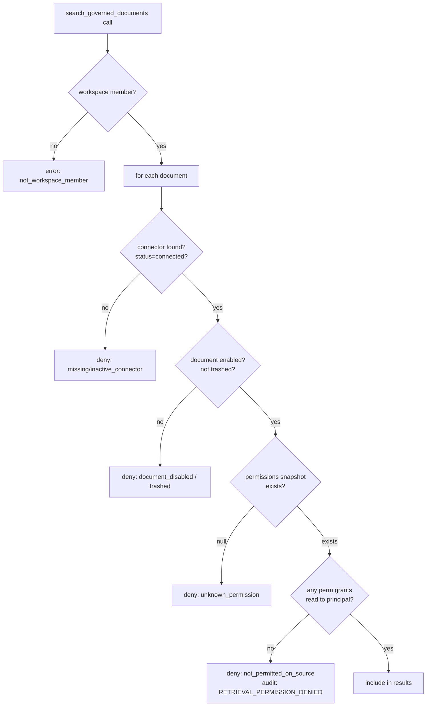
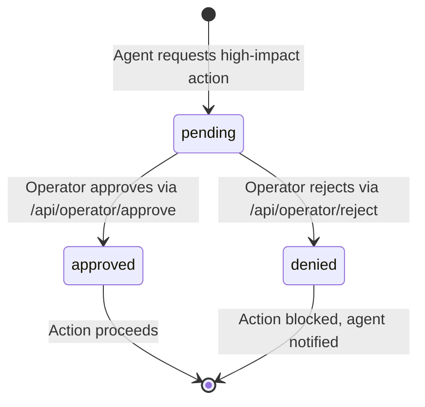

# Workflows — CollabMind Control Plane

## 1. Memory Write (Agent → storage)

## 2. Memory Search / Context Build (Agent retrieval)

### Context Pack Build (central-api Python contract)

Adds RRF across memory + code backends, builds a single cited bundle:

## 3. Document Ingestion (connector → Qdrant)

Permission snapshots (`source_document_permissions`) are taken at sync time. Retrieval governance uses the snapshot, not live Drive ACL.

## 4. Agent Action Request (requires_approval flow)

## 5. Retrieval Governance Check (per-document, fail-closed)

Every denied document writes a `RETRIEVAL_PERMISSION_DENIED` audit event.

## 6. Auth Resolution Order

Both `collabmind-api` (edge) and `memory-controller` (internal) follow the same priority:

1. `x-cm-context` header → verify HMAC → trust (memory-controller only)
2. `X-Api-Key` header → SHA-256 lookup in `api_keys`
3. `Authorization: Bearer mem11_sk_…` → same as API key
4. `Authorization: Bearer eyJ…` → Authentik JWKS JWT RS256
5. Dev fallback (non-production only) → default tenant/actor

## 7. Operator Review Queue (console)

Approval records live in `operator_approvals` table. All state changes are audited.
