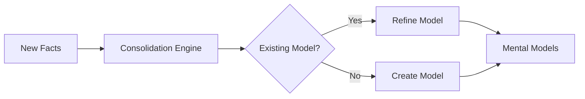

Today we're releasing Hindsight 0.4.0, which introduces **Mental Models** — a unified approach to knowledge consolidation that brings together the best of observations and opinions into a single, more powerful system.

<!-- truncate -->

## Evolution from Observations and Opinions

In Hindsight 0.3.0, we had two separate systems for synthesized knowledge:

- **Observations**: Per-entity summaries synthesized from related facts. Generated automatically for frequently-mentioned entities — if "Alice" appeared in many facts, you'd get an observation like "Alice is a software engineer at Google who joined in 2020 and leads the search team." Objective and entity-scoped.

- **Opinions**: Beliefs formed during `reflect` operations, influenced by the bank's disposition traits. These captured subjective judgments with confidence scores, like "Python is best for data science" (confidence: 0.85).

Both systems served their purpose well, but they operated independently. Observations were entity-centric, opinions were belief-centric, and neither captured the full picture of how knowledge evolves over time.

**Mental Models** unify these concepts into a single, more expressive system that captures patterns, preferences, and learnings as they emerge from accumulated evidence.

## What Are Mental Models?

Mental models are **consolidated knowledge** synthesized from multiple facts. Unlike raw facts which are individual pieces of information, mental models represent patterns and insights that emerge from accumulated evidence.

| Raw Facts | Mental Model |
|-----------|--------------|
| "Alice prefers Python" | "Alice is a Python-focused developer who values readability and simplicity, recommends type hints, and prefers pytest for testing" |
| "Alice dislikes verbose code" | |
| "Alice recommends type hints" | |

### Automatic Background Consolidation

After every `retain()` call, Hindsight's consolidation engine runs automatically:

1. **Analyzes new facts** against existing knowledge
2. **Detects patterns** across related information
3. **Synthesizes mental models** that capture higher-order insights
4. **Tracks evidence** linking each model to its supporting facts



### Evidence-Based Evolution

Mental models evolve as new evidence arrives, capturing the full journey rather than just the current state:

| Time | Fact | Mental Model |
|------|------|--------------|
| Week 1 | "User loves React" | "User prefers React for frontend development" |
| Week 2 | "User praises React's component model" | "User is enthusiastic about React, particularly its component model" |
| Week 3 | "User switched to Vue and won't use React anymore" | "User was previously a React enthusiast who appreciated its component model, but has now switched to Vue" |

Notice how the final mental model captures the **full journey** — not just "User prefers Vue" but the complete evolution. Your agent now understands:

- The user deliberately moved away from React (it wasn't ignorance)
- They previously appreciated React's component model (relevant context)
- Recommending React tutorials would be inappropriate

### Mission-Oriented Consolidation

Mental models are influenced by your bank's **mission**. When you set a mission, the consolidation engine focuses on extracting knowledge that serves that purpose:

```python
client.create_bank(
    bank_id="support-agent",
    mission="You're a customer support agent - track customer preferences, "
            "past issues, and communication styles."
)
```

With this mission, the engine prioritizes customer-relevant mental models while skipping ephemeral details. Without a mission, it performs general-purpose consolidation.

## What Changes from 0.3.0

### Unified Memory Types

Opinions and entity observations are now consolidated into mental models:

```python
# 0.3.0 - opinions via types, observations via include_entities
response = client.recall(
    bank_id="my-bank",
    query="What do you think about Python?",
    types=["opinion"],
    include_entities=True  # to get entity observations
)

# 0.4.0 - mental models unify both
response = client.recall(
    bank_id="my-bank",
    query="What do you think about Python?",
    types=["mental_model"]
)
```

### From Confidence Scores to Evidence Tracking

Opinions had numeric confidence scores (0.0-1.0). Mental models instead track:

- **Supporting facts**: The evidence behind the model
- **Last updated**: When the model was last refined
- **Freshness**: Whether the model reflects recent information

This shift from a single score to evidence tracking means your agent can explain *why* it believes something, not just *how confident* it is.

### Automatic vs On-Demand

Observations were created automatically for top entities, but opinions only formed during `reflect`. Mental models are always consolidated automatically after `retain`, ensuring knowledge stays current without explicit queries.

### Background Becomes Mission

The bank's `background` field has been renamed to `mission`. During the migration, your existing background text is automatically copied to the mission field — no action needed.

### Enabling Mental Models

Mental models are disabled by default in 0.4.0 as an experimental feature. To enable them, set the environment variable:

```bash
HINDSIGHT_API_ENABLE_MENTAL_MODELS=true
```

Once enabled, mental models will be automatically consolidated after each `retain()` call.

### Agentic Reflect

The `reflect` operation is now agentic — it reasons more deeply by iteratively retrieving memories and consulting mental models before formulating a response. This makes reflect significantly smarter, especially for complex questions that require synthesizing information across multiple topics.

The trade-off is that reflect may take longer to respond. For latency-sensitive use cases, consider using `recall` directly when you just need to retrieve facts.

### Data Migration

**Important:** When upgrading to 0.4.0, existing opinions and observations will be deleted. The consolidation engine will automatically create new mental models from your existing facts. This is a one-time migration — your raw facts are preserved, and mental models will be synthesized from them after the upgrade.

### Migration Checklist

**If you were using `types=["opinion"]` in recall:**

1. Update to `types=["mental_model"]`
2. Mental models combine both entity-centric summaries and belief-based insights

**If you were using `include_entities=True` in recall:**

1. Entity observations are now included in mental models
2. Use `types=["mental_model"]` to retrieve them

**If you were relying on confidence scores:**

1. Use the `based_on` field to access supporting evidence
2. The number and recency of supporting facts indicates strength

**If you were setting `background` on banks:**

1. The field is now called `mission`
2. Existing values are migrated automatically

**No changes needed for reflect:**

Mental models are automatically included in reflect responses via the `based_on` field.

## What's Next

Mental models are the foundation for more sophisticated agent memory capabilities we're exploring:

- **Temporal reasoning**: Better understanding of how knowledge evolves over time
- **Selective consolidation**: Fine-grained control over what gets synthesized into mental models
- **Consolidation insights**: Visibility into how mental models are formed and updated

---

**Resources:**
- [Recall API](/developer/api/recall) — retrieve mental models alongside facts
- [Reflect API](/developer/api/reflect) — responses now include supporting mental models
- [Full Changelog](/changelog)
