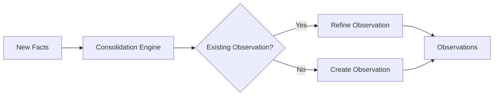
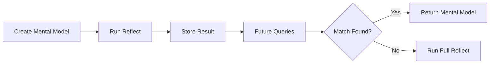

Today we're releasing Hindsight 0.4.0, which introduces two powerful learning capabilities for AI agents: **Observations** for automatic knowledge consolidation, and **Mental Models** for user-curated summaries.

<!-- truncate -->

## Two Levels of Learning

Hindsight 0.4.0 introduces a hierarchical learning system:

| Level | What It Is | How It's Created |
|-------|------------|------------------|
| **Mental Models** | User-curated summaries for common queries | Manually created via API |
| **Observations** | Consolidated knowledge from facts | Automatically after retain |

During `reflect`, the agent checks these in priority order — mental models first (your curated knowledge), then observations (automatic synthesis), then raw facts.

---

## Observations: Automatic Knowledge Consolidation

### Evolution from Entity Summaries and Opinions

In Hindsight 0.3.0, we had two separate systems for synthesized knowledge:

- **Entity summaries**: Per-entity summaries synthesized from related facts. Generated automatically for frequently-mentioned entities — if "Alice" appeared in many facts, you'd get a summary like "Alice is a software engineer at Google who joined in 2020 and leads the search team." Objective and entity-scoped.

- **Opinions**: Beliefs formed during `reflect` operations, influenced by the bank's disposition traits. These captured subjective judgments with confidence scores, like "Python is best for data science" (confidence: 0.85).

Both systems served their purpose well, but they operated independently. Entity summaries were entity-centric, opinions were belief-centric, and neither captured the full picture of how knowledge evolves over time.

**Observations** unify these concepts into a single, more expressive system that captures patterns, preferences, and learnings as they emerge from accumulated evidence.

### What Are Observations?

Observations are **consolidated knowledge** synthesized from multiple facts. Unlike raw facts which are individual pieces of information, observations represent patterns and insights that emerge from accumulated evidence.

| Raw Facts | Observation |
|-----------|--------------|
| "Alice prefers Python" | "Alice is a Python-focused developer who values readability and simplicity, recommends type hints, and prefers pytest for testing" |
| "Alice dislikes verbose code" | |
| "Alice recommends type hints" | |

### Automatic Background Consolidation

After every `retain()` call, Hindsight's consolidation engine runs automatically:

1. **Analyzes new facts** against existing knowledge
2. **Detects patterns** across related information
3. **Synthesizes observations** that capture higher-order insights
4. **Tracks evidence** linking each observation to its supporting facts



### Evidence-Based Evolution

Observations evolve as new evidence arrives, capturing the full journey rather than just the current state:

| Time | Fact | Observation |
|------|------|--------------|
| Week 1 | "User loves React" | "User prefers React for frontend development" |
| Week 2 | "User praises React's component model" | "User is enthusiastic about React, particularly its component model" |
| Week 3 | "User switched to Vue and won't use React anymore" | "User was previously a React enthusiast who appreciated its component model, but has now switched to Vue" |

Notice how the final observation captures the **full journey** — not just "User prefers Vue" but the complete evolution. Your agent now understands:

- The user deliberately moved away from React (it wasn't ignorance)
- They previously appreciated React's component model (relevant context)
- Recommending React tutorials would be inappropriate

### Mission-Oriented Consolidation

Observations are influenced by your bank's **mission**. When you set a mission, the consolidation engine focuses on extracting knowledge that serves that purpose:

```python
client.create_bank(
    bank_id="support-agent",
    mission="You're a customer support agent - track customer preferences, "
            "past issues, and communication styles."
)
```

With this mission, the engine prioritizes customer-relevant observations while skipping ephemeral details. Without a mission, it performs general-purpose consolidation.

---

## Mental Models: User-Curated Knowledge

While observations are created automatically, **mental models** give you explicit control over how your agent answers common questions.

### What Are Mental Models?

Mental models are **saved reflect responses** that you curate for your memory bank. When you create a mental model, Hindsight runs a reflect operation with your source query and stores the result. During future reflect calls, these pre-computed summaries are checked first.



### Why Use Mental Models?

| Benefit | Description |
|---------|-------------|
| **Consistency** | Same answer every time for common questions |
| **Speed** | Pre-computed responses are returned instantly |
| **Quality** | Manually curated summaries you've reviewed |
| **Control** | Define exactly how key topics should be answered |

### Two Ways to Use Mental Models

Mental models work in two ways:

1. **Automatic via Reflect**: During `reflect` calls, the agent automatically checks mental models first. If a relevant one exists, it's used to inform the response.

2. **Direct Lookup**: Mental models work like a key-value store — you can retrieve them instantly by ID, bypassing the reflect reasoning loop entirely.

```python
# Direct lookup by ID — instant response, no LLM call
mental_model = client.get_mental_model(
    bank_id="my-bank",
    mental_model_id="team-communication"
)
print(mental_model.content)  # Pre-computed answer, ready to use
```

This is useful when you know exactly what mental model you need and want the fastest possible response — no LLM reasoning required, just a simple database lookup.

### Creating Mental Models

```python
# Create a mental model for a common question
response = client.create_mental_model(
    bank_id="my-bank",
    name="Team Communication Preferences",
    source_query="How does the team prefer to communicate?",
    tags=["team"]
)
```

### Automatic Refresh

Mental models can automatically stay in sync with your observations:

```python
# Mental model that refreshes when observations update
response = client.create_mental_model(
    bank_id="my-bank",
    name="Project Status",
    source_query="What is the current project status?",
    trigger={"refresh_after_consolidation": True}
)
```

---

## Directives: Compliance and Guardrails

In addition to learning capabilities, **directives** provide hard rules that your agent must always follow during reflect operations. Unlike disposition traits which *influence* reasoning style, directives are absolute requirements that are enforced in every response.

Use directives for compliance, privacy, and safety constraints:
- "Never provide medical diagnoses or treatment advice"
- "Always respond in formal English"
- "Never share personally identifiable information"
- "Always cite sources when making factual claims"

Directives are injected into reflect prompts as hard constraints and are included in the response's `based_on` field. See the [Directives documentation](../developer/api/memory-banks#directives) for how to create and manage them.

---

## What Changes from 0.3.0

### Unified Memory Types

Opinions and entity summaries are now consolidated into observations:

```python
# 0.3.0 - opinions via types, entity summaries via include_entities
response = client.recall(
    bank_id="my-bank",
    query="What do you think about Python?",
    types=["opinion"],
    include_entities=True  # to get entity summaries
)

# 0.4.0 - observations unify both
response = client.recall(
    bank_id="my-bank",
    query="What do you think about Python?",
    types=["observation"]
)
```

### From Confidence Scores to Evidence Tracking

Opinions had numeric confidence scores (0.0-1.0). Observations instead track:

- **Supporting facts**: The evidence behind the observation
- **Last updated**: When the observation was last refined
- **Freshness**: Whether the observation reflects recent information

This shift from a single score to evidence tracking means your agent can explain *why* it believes something, not just *how confident* it is.

### Automatic vs On-Demand

Entity summaries were created automatically for top entities, but opinions only formed during `reflect`. Observations are always consolidated automatically after `retain`, ensuring knowledge stays current without explicit queries.

### Background Becomes Mission

The bank's `background` field has been renamed to `mission`. During the migration, your existing background text is automatically copied to the mission field — no action needed.

### Agentic Reflect

The `reflect` operation is now agentic — it reasons more deeply by iteratively retrieving memories and consulting mental models and observations before formulating a response. This makes reflect significantly smarter, especially for complex questions that require synthesizing information across multiple topics.

The trade-off is that reflect may take longer to respond. For latency-sensitive use cases, consider using `recall` directly when you just need to retrieve facts.

### Data Migration

**Important:** When upgrading to 0.4.0, existing opinions and entity summaries will be deleted. The consolidation engine will automatically create new observations from your existing facts. This is a one-time migration — your raw facts are preserved, and observations will be synthesized from them after the upgrade.

### Migration Checklist

**If you were using `types=["opinion"]` in recall:**

1. Update to `types=["observation"]`
2. Observations combine both entity-centric summaries and belief-based insights

**If you were using `include_entities=True` in recall:**

1. Entity summaries are now included in observations
2. Use `types=["observation"]` to retrieve them

**If you were relying on confidence scores:**

1. Use the `based_on` field to access supporting evidence
2. The number and recency of supporting facts indicates strength

**If you were setting `background` on banks:**

1. The field is now called `mission`
2. Existing values are migrated automatically

**No changes needed for reflect:**

Observations are automatically included in reflect responses via the `based_on` field.

---

## What's Next

These learning capabilities are the foundation for more sophisticated agent memory capabilities we're exploring:

- **Temporal reasoning**: Better understanding of how knowledge evolves over time
- **Selective consolidation**: Fine-grained control over what gets synthesized into observations
- **Consolidation insights**: Visibility into how observations are formed and updated

---

**Resources:**
- [Recall API](../developer/api/recall) — retrieve observations alongside facts
- [Reflect API](../developer/api/reflect) — responses now include supporting observations
- [Mental Models API](../developer/api/mental-models) — create and manage curated summaries
- [Observations Guide](../developer/observations) — deep dive into knowledge consolidation
- [Directives](../developer/api/memory-banks#directives) — hard rules for compliance and guardrails
- [Full Changelog](../changelog)
