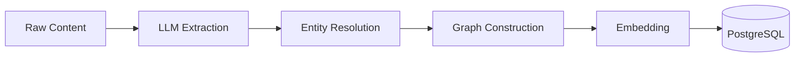

# Ingest Data

Store memories, conversations, and documents into Hindsight.

import Tabs from '@theme/Tabs';
import TabItem from '@theme/TabItem';

## Installation

<Tabs>
<TabItem value="python" label="Python">

```bash
pip install hindsight-client
```

</TabItem>
<TabItem value="node" label="Node.js">

```bash
npm install @hindsight/client
```

</TabItem>
<TabItem value="cli" label="CLI">

```bash
cd hindsight-cli && cargo build --release
```

</TabItem>
</Tabs>

## Store a Single Memory

<Tabs>
<TabItem value="python" label="Python">

```python
from hindsight_client import Hindsight

client = Hindsight(base_url="http://localhost:8888")

client.store(
    agent_id="my-agent",
    content="Alice works at Google as a software engineer"
)
```

</TabItem>
<TabItem value="node" label="Node.js">

```typescript
import { OpenAPI, MemoryStorageService } from '@hindsight/client';

OpenAPI.BASE = 'http://localhost:8888';

await MemoryStorageService.putApiPutPost({
    agent_id: 'my-agent',
    content: 'Alice works at Google as a software engineer'
});
```

</TabItem>
<TabItem value="cli" label="CLI">

```bash
hindsight memory put my-agent "Alice works at Google as a software engineer"
```

</TabItem>
</Tabs>

## Store with Context and Date

Add context and event dates for better retrieval:

<Tabs>
<TabItem value="python" label="Python">

```python
client.store(
    agent_id="my-agent",
    content="Alice got promoted to senior engineer",
    context="career update",
    event_date="2024-03-15T10:00:00Z"
)
```

</TabItem>
<TabItem value="cli" label="CLI">

```bash
hindsight memory put my-agent "Alice got promoted" \
    --context "career update" \
    --event-date "2024-03-15"
```

</TabItem>
</Tabs>

The `event_date` enables temporal queries like "What happened last spring?"

## Batch Ingestion

Store multiple memories in a single request:

<Tabs>
<TabItem value="python" label="Python">

```python
client.store_batch(
    agent_id="my-agent",
    items=[
        {"content": "Alice works at Google", "context": "career"},
        {"content": "Bob is a data scientist at Meta", "context": "career"},
        {"content": "Alice and Bob are friends", "context": "relationship"}
    ],
    document_id="conversation_001"
)
```

</TabItem>
<TabItem value="node" label="Node.js">

```typescript
await MemoryStorageService.batchApiMemoriesBatchPost({
    agent_id: 'my-agent',
    items: [
        { content: 'Alice works at Google', context: 'career' },
        { content: 'Bob is a data scientist at Meta', context: 'career' }
    ],
    document_id: 'conversation_001'
});
```

</TabItem>
</Tabs>

The `document_id` groups related memories for later management.

## Store from Files

<Tabs>
<TabItem value="cli" label="CLI">

```bash
# Single file
hindsight memory put-files my-agent document.txt

# Multiple files
hindsight memory put-files my-agent doc1.txt doc2.md notes.txt

# With document ID
hindsight memory put-files my-agent report.pdf --document-id "q4-report"
```

</TabItem>
</Tabs>

## What Happens During Ingestion

When you store content, Hindsight:

1. **Extracts facts** using an LLM — converts raw text into structured narrative facts
2. **Identifies entities** — people, places, organizations, concepts
3. **Resolves entities** — "Alice" and "Alice Chen" become the same entity
4. **Builds graph links** — connects memories through shared entities
5. **Generates embeddings** — 384-dim vectors for semantic search
6. **Stores to PostgreSQL** — with vector and full-text indexes



## Async Ingestion

For large batches, use async ingestion:

<Tabs>
<TabItem value="python" label="Python">

```python
# Start async ingestion
operation = client.store_batch_async(
    agent_id="my-agent",
    items=[...large batch...],
    document_id="large-doc"
)

# Check status
status = client.get_operation(operation["operation_id"])
print(status["status"])  # "pending", "processing", "completed", "failed"
```

</TabItem>
</Tabs>

## Best Practices

| Do | Don't |
|----|-------|
| Include context for better retrieval | Store raw unstructured dumps |
| Use document_id to group related content | Mix unrelated content in one batch |
| Add event_date for temporal queries | Omit dates if time matters |
| Store conversations as they happen | Wait to batch everything |
