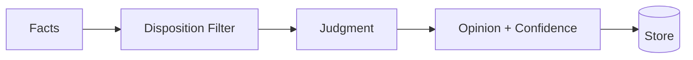

# Opinions

How memory banks form, store, and evolve beliefs.

import Tabs from '@theme/Tabs';
import TabItem from '@theme/TabItem';

:::tip Prerequisites
Make sure you've completed the [Quick Start](./quickstart) to install the client and start the server.
:::

## What Are Opinions?

Opinions are beliefs formed by the memory bank based on evidence and disposition. Unlike world facts (objective information received) or experience (conversations and events), opinions are **judgments** with confidence scores.

| Type | Example | Confidence |
|------|---------|------------|
| World Fact | "Python was created in 1991" | — |
| Experience | "I recommended Python to Bob" | — |
| Opinion | "Python is the best language for data science" | 0.85 |

## How Opinions Form

Opinions are created during `reflect` operations when the memory bank:
1. Retrieves relevant facts
2. Applies disposition traits
3. Forms a judgment
4. Assigns a confidence score



<Tabs>
<TabItem value="python" label="Python">

```python
# Ask a question that might form an opinion
answer = client.reflect(
    bank_id="my-bank",
    query="What do you think about functional programming?"
)

# Check if new opinions were formed
for opinion in answer.get("new_opinions", []):
    print(f"New opinion: {opinion['text']}")
    print(f"Confidence: {opinion['confidence']}")
```

</TabItem>
</Tabs>

## Searching Opinions

<Tabs>
<TabItem value="python" label="Python">

```python
# Search only opinions
opinions = client.recall(
    bank_id="my-bank",
    query="programming languages",
    types=["opinion"]
)

for op in opinions:
    print(f"{op['text']} (confidence: {op['confidence_score']:.2f})")
```

</TabItem>
<TabItem value="cli" label="CLI">

```bash
hindsight recall my-bank "programming" --types opinion
```

</TabItem>
</Tabs>

## Opinion Evolution

Opinions change as new evidence arrives:

| Evidence Type | Effect |
|---------------|--------|
| **Reinforcing** | Confidence increases (+0.1) |
| **Weakening** | Confidence decreases (-0.15) |
| **Contradicting** | Opinion revised, confidence reset |

**Example evolution:**

```
t=0: "Python is best for data science" (0.70)
     ↓ New evidence: Python dominates ML libraries
t=1: "Python is best for data science" (0.85)
     ↓ New evidence: Julia is 10x faster for numerical computing
t=2: "Python is best for data science, though Julia is faster" (0.75)
     ↓ New evidence: Most teams still use Python
t=3: "Python is best for data science" (0.82)
```

## Disposition Influence

Different dispositions form different opinions from the same facts:

<Tabs>
<TabItem value="python" label="Python">

```python
# Create two memory banks with different dispositions
client.create_bank(
    bank_id="open-minded",
    disposition={"skepticism": 2, "literalism": 2, "empathy": 4}
)

client.create_bank(
    bank_id="conservative",
    disposition={"skepticism": 5, "literalism": 5, "empathy": 2}
)

# Store the same facts to both
facts = [
    "Rust has better memory safety than C++",
    "C++ has a larger ecosystem and more libraries",
    "Rust compile times are longer than C++"
]
for fact in facts:
    client.retain(bank_id="open-minded", content=fact)
    client.retain(bank_id="conservative", content=fact)

# Ask both the same question
q = "Should we rewrite our C++ codebase in Rust?"

answer1 = client.reflect(bank_id="open-minded", query=q)
# Likely: "Yes, Rust's safety benefits outweigh migration costs"

answer2 = client.reflect(bank_id="conservative", query=q)
# Likely: "No, C++'s ecosystem and our team's expertise make it the safer choice"
```

</TabItem>
</Tabs>

## Opinions in Reflect Responses

When `reflect` uses opinions, they appear in `based_on`:

```python
answer = client.reflect(bank_id="my-bank", query="What language should I learn?")

print("World facts used:")
for f in answer.based_on.get("world", []):
    print(f"  {f['text']}")

print("\nOpinions used:")
for o in answer.based_on.get("opinion", []):
    print(f"  {o['text']} (confidence: {o['confidence_score']})")
```

## Confidence Thresholds

Opinions below a confidence threshold may be:
- Excluded from responses
- Marked as uncertain
- Revised more easily

```python
# Low confidence opinions are held loosely
# "I think Python might be good for this" (0.45)

# High confidence opinions are stated firmly
# "Python is definitely the right choice" (0.92)
```
