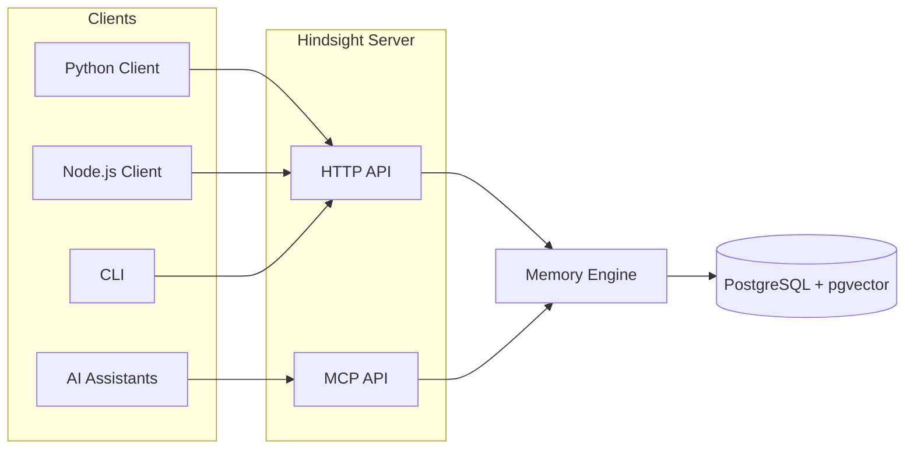
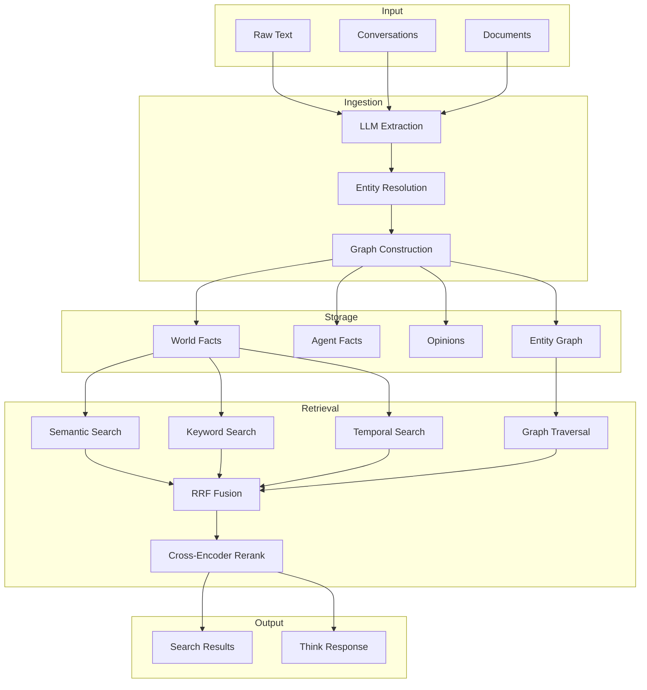
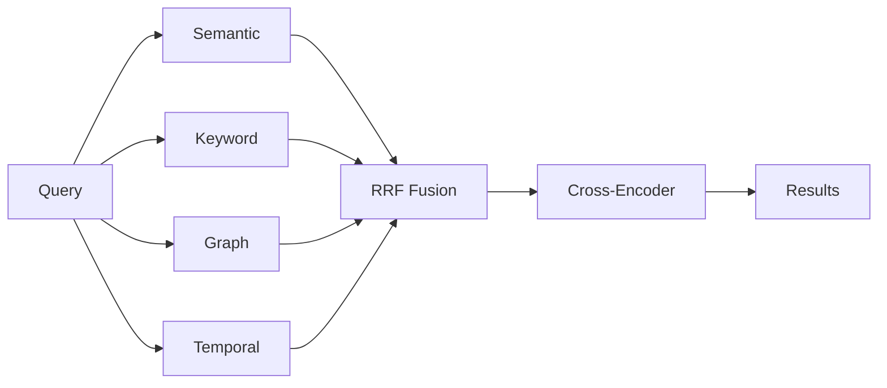
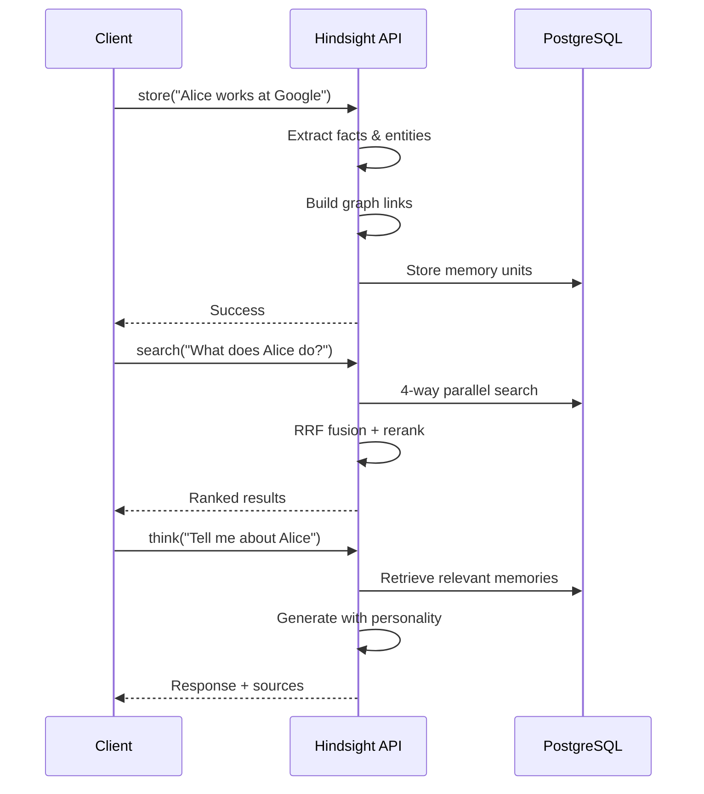

# Overview

## Why Hindsight?

AI assistants forget everything between sessions. Every conversation starts from zero—no context about who you are, what you've discussed, or what the agent has learned. This isn't just inconvenient; it fundamentally limits what AI agents can do.

**The problem is harder than it looks:**

- **Simple vector search isn't enough** — "What did Alice do last spring?" requires temporal reasoning, not just semantic similarity
- **Facts get disconnected** — Knowing "Alice works at Google" and "Google is in Mountain View" should let you answer "Where does Alice work?" even if you never stored that directly
- **Agents need opinions** — A coding assistant that remembers "the user prefers functional programming" should weigh that when making recommendations
- **Context matters** — The same information means different things to different agents with different personalities

Hindsight solves these problems with a memory system designed specifically for AI agents.

## What Hindsight Does

**Store** conversations and documents → **Search** with multi-strategy retrieval → **Think** with personality-aware reasoning

## Architecture

## Key Components

### Three Memory Networks

Hindsight separates memories by type for epistemic clarity:

| Network | What it stores | Example |
|---------|----------------|---------|
| **World** | Objective facts received | "Alice works at Google" |
| **Agent** | Agent's own actions | "I recommended Python to Bob" |
| **Opinion** | Formed beliefs + confidence | "Python is best for ML" (0.85) |

### Multi-Strategy Retrieval (TEMPR)

Four search strategies run in parallel:

| Strategy | Best for |
|----------|----------|
| **Semantic** | Conceptual similarity, paraphrasing |
| **Keyword (BM25)** | Names, technical terms, exact matches |
| **Graph** | Related entities, indirect connections |
| **Temporal** | "last spring", "in June", time ranges |

### Personality Framework (CARA)

Agents have Big Five personality traits that influence opinion formation:

| Trait | Low | High |
|-------|-----|------|
| **Openness** | Prefers proven methods | Embraces new ideas |
| **Conscientiousness** | Flexible, spontaneous | Systematic, organized |
| **Extraversion** | Independent | Collaborative |
| **Agreeableness** | Direct, analytical | Diplomatic, harmonious |
| **Neuroticism** | Calm, optimistic | Risk-aware, cautious |

The `bias_strength` parameter (0-1) controls how much personality influences opinions.

## Client-Server Interaction

## Next Steps

- [Quick Start](/developer/api/quickstart) — Get up and running in 60 seconds

- [Architecture](./developer/architecture) — Deep dive into ingestion, storage, and graph construction
- [Retrieval](./developer/retrieval) — How TEMPR's 4-way search works
- [Personality](./developer/personality) — CARA framework and opinion formation
- [Ingest Data](./developer/api/ingest) — Store memories, conversations, and documents
- [Search Facts](./developer/api/search) — Multi-strategy retrieval
- [Think](./developer/api/think) — Personality-aware response generation
- [Server Deployment](./developer/server) — Deploy with Docker Compose, Helm, or pip
- [Development Guide](./developer/development) — Set up a local development environment
