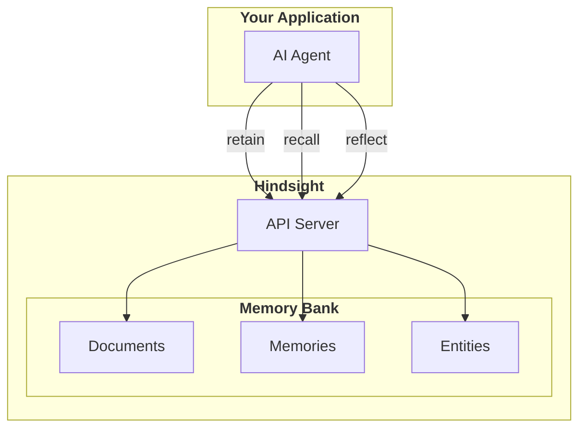

# Overview

## Why Hindsight?

AI agents forget everything between sessions. Every conversation starts from zero—no context about who you are, what you've discussed, or what the assistant has learned. This isn't just an implementation detail; it fundamentally limits what AI Agents can do.

**The problem is harder than it looks:**

- **Simple vector search isn't enough** — "What did Alice do last spring?" requires temporal reasoning, not just semantic similarity
- **Facts get disconnected** — Knowing "Alice works at Google" and "Google is in Mountain View" should let you answer "Where does Alice work?" even if you never stored that directly
- **AI Agents needs to form opinions** — A coding assistant that remembers "the user prefers functional programming" should weigh that when making recommendations
- **Context matters** — The same information means different things to different memory banks with different personalities

Hindsight solves these problems with a memory system designed specifically for AI agents.

## What Hindsight Does

**Your AI agent** stores information via `retain()`, searches with `recall()`, and reasons with `reflect()` — all interactions with its dedicated **memory bank**

## Key Components

### Three Memory Types

Hindsight separates memories by type for epistemic clarity:

| Type | What it stores | Example |
|------|----------------|---------|
| **World** | Objective facts received | "Alice works at Google" |
| **Bank** | Bank's own actions | "I recommended Python to Bob" |
| **Opinion** | Formed beliefs + confidence | "Python is best for ML" (0.85) |

### Multi-Strategy Retrieval (TEMPR)

Four search strategies run in parallel:

| Strategy | Best for |
|----------|----------|
| **Semantic** | Conceptual similarity, paraphrasing |
| **Keyword (BM25)** | Names, technical terms, exact matches |
| **Graph** | Related entities, indirect connections |
| **Temporal** | "last spring", "in June", time ranges |

### Disposition Traits

Memory banks have disposition traits that influence how opinions are formed during Reflect:

| Trait | Scale | Low (1) | High (5) |
|-------|-------|---------|----------|
| **Skepticism** | 1-5 | Trusting | Skeptical |
| **Literalism** | 1-5 | Flexible interpretation | Literal interpretation |
| **Empathy** | 1-5 | Detached | Empathetic |

These traits only affect the `reflect` operation, not `recall`.

## Next Steps

### Getting Started
- [**Quick Start**](/developer/api/quickstart) — Install and get up and running in 60 seconds
- [**RAG vs Hindsight**](/developer/rag-vs-hindsight) — See how Hindsight differs from traditional RAG with real examples

### Core Concepts
- [**Retain**](/developer/retain) — How memories are stored with multi-dimensional facts
- [**Recall**](/developer/retrieval) — How TEMPR's 4-way search retrieves memories
- [**Reflect**](/developer/reflect) — How disposition influences reasoning and opinion formation

### API Methods
- [**Retain**](/developer/api/retain) — Store information in memory banks
- [**Recall**](/developer/api/recall) — Search and retrieve memories
- [**Reflect**](/developer/api/reflect) — Reason with disposition
- [**Memory Banks**](/developer/api/memory-banks) — Configure disposition and background
- [**Entities**](/developer/api/entities) — Track people, places, and concepts
- [**Documents**](/developer/api/documents) — Manage document sources
- [**Operations**](/developer/api/operations) — Monitor async tasks

### Deployment
- [**Server Setup**](/developer/installation) — Deploy with Docker Compose, Helm, or pip
