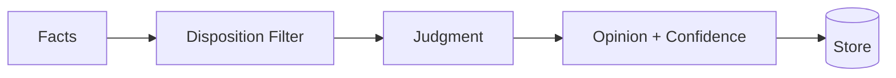

# Opinions

How memory banks form, store, and evolve beliefs.

import Tabs from '@theme/Tabs';
import TabItem from '@theme/TabItem';
import CodeSnippet from '@site/src/components/CodeSnippet';

{/* Import raw source files */}
import opinionsPy from '!!raw-loader!@site/examples/api/opinions.py';
import opinionsMjs from '!!raw-loader!@site/examples/api/opinions.mjs';

:::tip Prerequisites
Make sure you've completed the [Quick Start](./quickstart) to install the client and start the server.
:::

## What Are Opinions?

Opinions are beliefs formed by the memory bank based on evidence and disposition. Unlike world facts (objective information received) or experience (conversations and events), opinions are **judgments** with confidence scores.

| Type | Example | Confidence |
|------|---------|------------|
| World Fact | "Python was created in 1991" | — |
| Experience | "I recommended Python to Bob" | — |
| Opinion | "Python is the best language for data science" | 0.85 |

## How Opinions Form

Opinions are created during `reflect` operations when the memory bank:
1. Retrieves relevant facts
2. Applies disposition traits
3. Forms a judgment
4. Assigns a confidence score



<Tabs>
<TabItem value="python" label="Python">
<CodeSnippet code={opinionsPy} section="opinion-form" language="python" />
</TabItem>
<TabItem value="node" label="Node.js">
<CodeSnippet code={opinionsMjs} section="opinion-form" language="javascript" />
</TabItem>
</Tabs>

## Searching Opinions

<Tabs>
<TabItem value="python" label="Python">
<CodeSnippet code={opinionsPy} section="opinion-search" language="python" />
</TabItem>
<TabItem value="node" label="Node.js">
<CodeSnippet code={opinionsMjs} section="opinion-search" language="javascript" />
</TabItem>
<TabItem value="cli" label="CLI">

```bash
hindsight recall my-bank "programming" --types opinion
```

</TabItem>
</Tabs>

## Opinion Evolution

Opinions change as new evidence arrives:

| Evidence Type | Effect |
|---------------|--------|
| **Reinforcing** | Confidence increases (+0.1) |
| **Weakening** | Confidence decreases (-0.15) |
| **Contradicting** | Opinion revised, confidence reset |

**Example evolution:**

```
t=0: "Python is best for data science" (0.70)
     ↓ New evidence: Python dominates ML libraries
t=1: "Python is best for data science" (0.85)
     ↓ New evidence: Julia is 10x faster for numerical computing
t=2: "Python is best for data science, though Julia is faster" (0.75)
     ↓ New evidence: Most teams still use Python
t=3: "Python is best for data science" (0.82)
```

## Disposition Influence

Different dispositions form different opinions from the same facts:

<Tabs>
<TabItem value="python" label="Python">
<CodeSnippet code={opinionsPy} section="opinion-disposition" language="python" />
</TabItem>
<TabItem value="node" label="Node.js">
<CodeSnippet code={opinionsMjs} section="opinion-disposition" language="javascript" />
</TabItem>
</Tabs>

## Opinions in Reflect Responses

When `reflect` uses opinions, they appear in `based_on`:

<Tabs>
<TabItem value="python" label="Python">
<CodeSnippet code={opinionsPy} section="opinion-in-reflect" language="python" />
</TabItem>
<TabItem value="node" label="Node.js">
<CodeSnippet code={opinionsMjs} section="opinion-in-reflect" language="javascript" />
</TabItem>
</Tabs>

## Confidence Thresholds

Opinions below a confidence threshold may be:
- Excluded from responses
- Marked as uncertain
- Revised more easily

```python
# Low confidence opinions are held loosely
# "I think Python might be good for this" (0.45)

# High confidence opinions are stated firmly
# "Python is definitely the right choice" (0.92)
```
